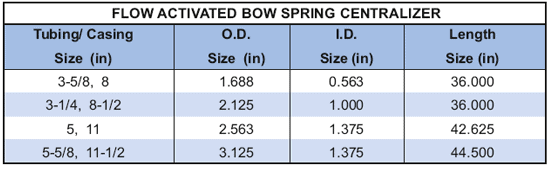

Центратор с дуговой пружиной, активируемый потоком, предназначенный для централизации инструментальной струны или ее частей в НКТ/обсадной колонне для выполнения различных операций. Центратор с дуговой пружиной, активируемой потоком, сконструирован таким образом, что его дуговые пружины обычно натянуты. Дуговые пружины расширяются только тогда, когда на инструменте охватывается перепад давления.

