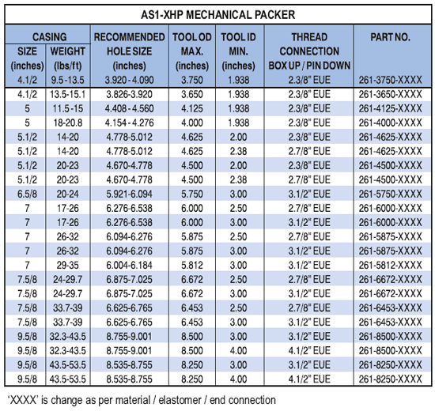

Пакер PARVEEN AS1-XHP является наиболее универсальным механическим из устанавливаемых извлекаемых пакеров и может использоваться в любых производственных условиях. AS1-XHP подходит для обработки, испытаний, нагнетания, откачки скважин, фонтанирующих скважин, скважин или неглубоких. Пакер можно оставить в натянутом или сжатом состоянии, в зависимости от состояния скважины и требуемого применения. Большой внутренний перепускной канал поглощения свабирование при спуске и изъятии. Байпас закрывается, когда пакер установлен, и открывается передний верхний клиньев захвата, чтобы обеспечить выравнивание давления. Конструкция J-образного паза позволяет легко пользоваться и пользоваться; 1/4 оборота правая установка, правая разблокировка.Запатентованная система высвобождения выше плашка значительной силы, необходимой для высвобождения пакера. Ненаправленная накладка высвобождается первой, что блокирует выпуск других накладок.

**Особенности, преимущества и выгоды:**

* Конструкция выдерживает высокую перепад давления как верхний, так и в основе, что позволяет использовать пакер в большинстве случаев при добыче, интенсификации накопления и закачке.
* Пакер может быть настроен на сжатие, натяжение его или трос, что позволяет использовать как на мелководье, так и на глубине.
* Пакер может быть установлен и погиб всего за четверть оборота НКТ.
* Перепускной клапан находится под верхними плашками, так что мусор вымывается из плашек при открытии клапана, что обеспечивает время циркуляции и полного изъятия.
* Полное открытие захвата беспрепятственного потока и прохождения канатных инструментов и других пакерных систем.
* Пакер можно запускать с помощью инструмента PARVEEN T-2, который позволяет отсоединять и использовать НКТ без изъятия пакера.

**Параметры:**

* Варианты эластомера для агрессивных сред.
* Доступны дополнительные предохранительные версии.

