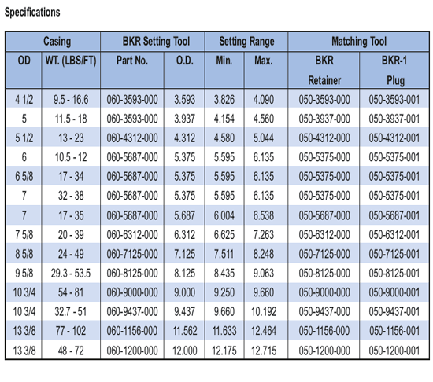

Механический инструмент для установки модели BKR предназначен для использования и установки цементного фиксатора золотникового клапана модели BKR и мостовой пробки модели BKR-1. Он прост в эксплуатации и требует минимального технического обслуживания. Этот инструмент включает в себя как сальниковое увеличение, так и встроенную защелку, позволяющую фиксировать инструмент в фиксаторе с помощью уменьшаемого веса и свободы с усилием вверх и правым вращением. Этот инструмент можно запускать раз за разом, просто переводя корпус привода в принудительное положение. Разборка не требуется каждый раз. Наладочный инструмент можно переоборудовать для размеров обсадных труб от 4 1/2 до 13 3/8”.

