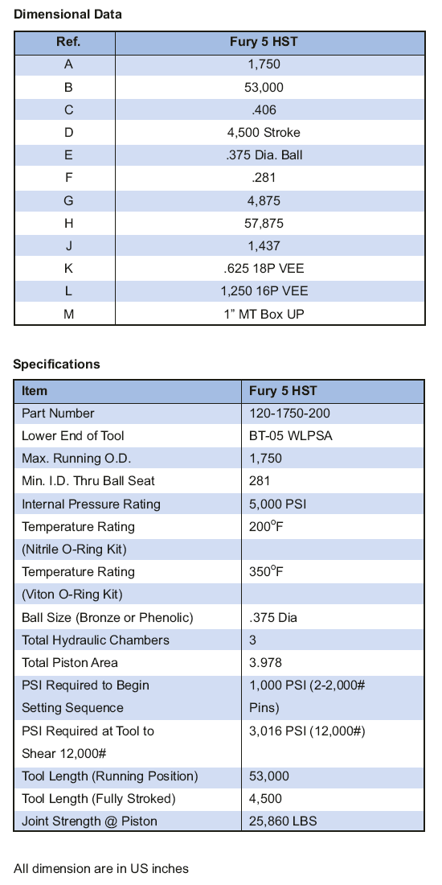

**Операционная процедура:**

1. Запустите гидравлический инструмент Fury 05 и BP/CR на несколько футов ниже скорости. Примечание. Порты циркуляции Fury садятся под шаровым седлом. Эти порты обычно трубе внедряются в скважины или требуют циркуляции с быстрой скоростью ¼ удара в минуту при входе в скважину. Скважинный флюид должен быть чистым и свободным от мусора (песка) для логики работы ГСТ. Предупреждение. Последовательность действий при перестройке давления в трубке «ускорение инструмента» 1000 фунтов на кв. дюйм (см. шаг 4).

2. Медленно поднимите на аварийную установку, чтобы исключить провисание колонны насосно-компрессорных труб.

3. Бросайте латунный шарик диаметром 3/8 дюйма и медленно прокачивайте до тех пор, пока он не сядет на место (увеличение давления).

4. Медленно надавите на давление колонну, чтобы установить перепад давления 1000 фунтов на кв. дюйм (макс. 1500 фунтов на кв. дюйм) внутри НКТ «на инструменте», чтобы начать последовательность.

5. Продолжайте создавать давление на давление колонны, чтобы создать перепад давления 2500 фунтов на квадратный дюйм внутри НКТ «у инструмента», чтобы закрепить BP/CR к стенке обсадной колонны. Поднимите трубку в нейтральное положение. Держите давление в течение 5 минут.

6. Продолжайте давление на давление в колонну, установите перепад давления 3100 фунтов на кв. дюйм (макс. 3600 фунтов на кв. дюйм) внутри НКТ «в

инструмент», чтобы получить набор. Поднимите трубку, чтобы определить, не отсоединена ли она от BP/CR. Если HST не соединился с BP/CR, то снова наберите 1000 фунтов сверхвеса НКТ и надавите на колонну, чтобы установить давление 3100 фунтов на кв. дюйм (макс. 3600 фунтов на кв. дюйм) внутри НКТ «на инструменте» для завершения установки. Чрезмерное давление HST отключает инструмент.

7. Предложите установочный массовый груз 1000 фунтов, чтобы определить, надежно ли установлены BP/CR.

8. Fury 5 HST автоматически сбрасывает давление при полном ходе. Очистите и заново запишите гидравлический инструмент для настройки и комплект адаптера для.

**Поиск неисправности:**

УСЛОВИЕ: HST не отключается от BP/CR

Натяните 1000 фунтов веса НКТ и снова надавите на колонну, чтобы установить давление 3100 фунтов на кв. дюйм (макс. 3600 фунтов на кв. дюйм) внутри НКТ «у инструмента» для отсоединения от BP/CR.

В случае отказа сбросьте давление, верните трубку в нейтральную точку и поменяйте направление циркуляции в трубке (+10 баррелей), чтобы удалить мусор, который может находиться внутри трубки и инструмента. Переместите шар обратно в седло шара, затем натяните 1000 фунтов на весовые трубы и снова надавите на установку колонну, чтобы установить давление 3100 фунтов на кв. В случае отказа сбросьте давление и натяните 12 000 фунтов веса трубы, чтобы отсоединить ее от BP/CR. Чрезмерное давление HST отключает инструмент.

