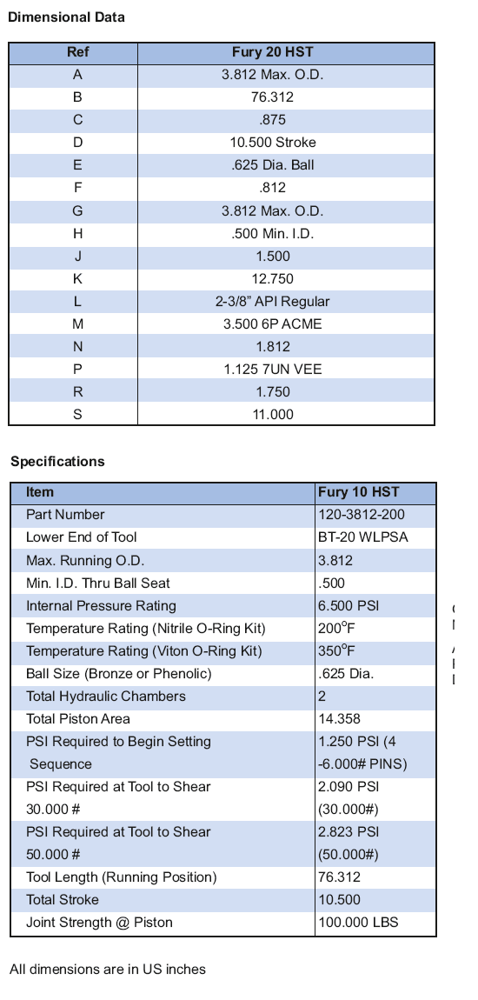

**Операционная процедура:**

1. Запустите гидравлический наладчик Model Fury 20 и BP/CR на несколько футов ниже частоты установки. Примечание. Порты циркуляции Fury садятся под шаровым седлом. Эти порты обычно трубе внедряются в скважины или требуют циркуляции с быстрой скоростью ¼ удара в минуту при входе в скважину. Скважинный флюид должен быть чистым и свободным от мусора (песка) для логики работы ГСТ. Предупреждение. Последовательность действий при перестановке давления в трубке «ускорение инструмента» 1250 фунтов на кв. дюйм (см. шаг 4).

2. Медленно поднимите на аварийную установку, чтобы исключить провисание колонны насосно-компрессорных труб.

3. Бросайте латунный шарик диаметром 5/8 дюйма и медленно прокачивайте до тех пор, пока он не сядет на место (увеличение давления).

4. Медленно надавите на давление колонну, чтобы установить перепад давления 1250 фунтов на кв. дюйм (макс. 1750 фунтов на кв. дюйм) внутри НКТ «на инструменте», чтобы начать последовательность.

5. Срез срезной шпильки весит 30 000 фунтов (обсадная труба 5-1/2” 6 дюймов) стенке обсадной колонны. Поднимите трубку в нейтральное положение. Держите давление в течение 5 минут.

6. Продолжайте создавать давление на давление колонну, установите перепад давления 2090 фунтов на кв. дюйм (макс. 2590 фунтов на кв. дюйм) внутри НКТ «на инструменте», чтобы увеличиться. Поднимите трубку, чтобы определить, не отсоединена ли она от BP/CR. Если HST не отсоединен от BP/CR, снова наберите 1000 фунтов сверхвеса НКТ и снова надавите на нагрузку колонну, чтобы установить давление 2090 фунтов на кв. дюйм (макс. 2590 фунтов на кв. дюйм) внутри НКТ «на инструменте» для завершения установки. Чрезмерное давление HST отключает инструмент.

7. Срез срезной шпильки весом 50 000 фунтов (обсадная колонна 7 дюймов и больше) Продолжайте создавать давление на повышающую колонну, чтобы создать перепад давления 2500 фунтов на квадратный дюйм внутри НКТ «на инструменте», чтобы закрепить BP/CR к стенке обсадной колонны. Поднимите трубку в нейтральное положение. Держите давление в течение 5 минут.

8. Продолжайте давление на давление в колонне, установите перепад давления в 3482 фунта на кв. дюйм (макс. 3982 фунта на кв. дюйм) внутри НКТ «на инструменте», до взрыва. Поднимите трубку, чтобы определить, не отсоединена ли она от BP/CR. Если HST не соединился с BP/CR, то снова наберите 1000 фунтов сверхвеса НКТ и надавите на нагрузку колонну, чтобы установить давление 3482 фунта на кв. дюйм (макс. 3982 фунта на кв. дюйм) внутри НКТ «на инструменте» для завершения установки. Чрезмерное давление HST отключает инструмент.

8. Предложите установочный массовый груз 1000 фунтов, чтобы определить, надежно ли установлены BP/CR.

9. Fury 20 HST автоматически сбрасывает давление при полном ходе. Очистите и заново запишите гидравлический инструмент для настройки и комплект адаптера для.

**Поиск неисправности:**

Условие: HST не отключается от BP/CR.

30 000-фунтовая срезная шпилька (обсадная труба 5-1/2 дюйма 6 дюймов)

Натяните 1000 фунтов веса НКТ и снова надавите на колонну, чтобы установить давление 2090 фунтов на кв. дюйм (макс. 2590 фунтов на кв. дюйм) внутри НКТ «у инструмента» для отсоединения от BP/CR.

В случае отказа сбросьте давление, верните трубку в нейтральную точку и поменяйте направление циркуляции в трубке (+10 баррелей), чтобы удалить мусор, который может находиться внутри трубки и инструмента. Переместите шар обратно в седло шара, затем натяните 1000 фунтов веса НКТ и снова надавите на правильную колонну, чтобы установить давление 2090 фунтов на кв.

В случае отказа сбросьте давление и натяните 30 000 фунтов веса трубы, чтобы отсоединить ее от BP/CR. Чрезмерное давление HST отключает инструмент. 50 000-фунтовая срезная шпилька (7 дюймов и корпус большего размера) Натяните 1000 фунтов на вес НКТ и снова надавите на нагрузку колонну, чтобы установить давление 3 482 фунта на кв. дюйм (макс. от БП/КР.

В случае отказа сбросьте давление, верните трубку в нейтральную точку и поменяйте направление циркуляции в трубке (+10 баррелей), чтобы удалить мусор, который может находиться внутри трубки и инструмента. Переместите шар обратно в седло шара, затем натяните 1000 фунтов на весовые трубы и снова надавите на соответствующую колонну, чтобы установить давление 3482 фунтов на кв.

В случае отказа сбросьте давление и натяните 50 000 фунтов веса трубы, чтобы отсоединить ее от BP/CR. Чрезмерное давление HST отключает инструмент.

