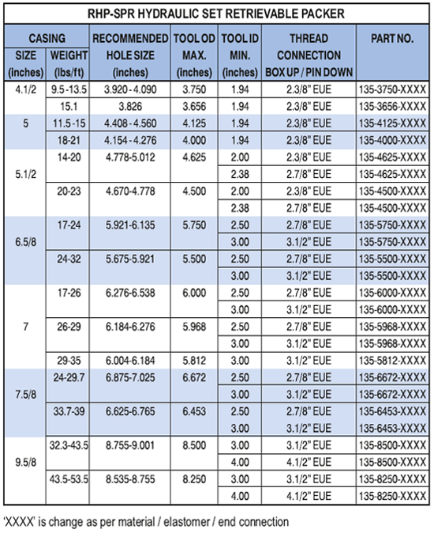

Пакер PARVEEN RHP-SPR представляет собой одноколонный извлекаемый пакер с гидравлическим приводом и может работать практически в любых производственных условиях. Давление НКТ используется для установки пакера, а усилие установки плотно фиксируется в пакере стопорным кольцом корпуса. Большой внутренний перепускной канал поглощения свабирование при спуске и изъятии. Байпас закрывается, когда установлен пакер, и открывается во время закрытия, чтобы обеспечить выравнивание давления. Срезные винты используются для контроля возврата пакета. Величина разъединения добавлением или удалением винтовки из корпуса сдвига или использованием стальных винтовок.Стандартные упаковки PARVEEN рассчитаны на перепад давления до 7500 фунтов на квадратный дюйм.

Функции:

* Штифты с прямым тяговым усилием не растут из-за перепада давления, что позволяет легко увеличить усилие действия перед запуском.
* Система двойного захвата позволяет пакеру надежно удерживать перепады давления верхнего и нижнего, предотвращая смещение элементов концентрации и точное отсоединение пакера.
* Все компоненты заблокированы, что предотвращает повышение давления или попадание мусора в пакер, что повышает надежность при спуске пакера в стволе скважины.
* Регулируемый газовый выпуск
* Прямой выпуск

