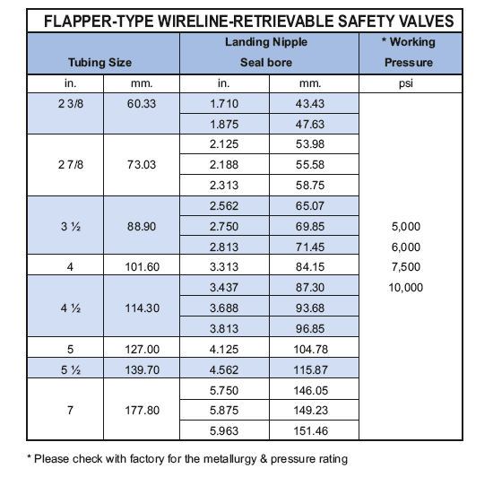

Посадочные ниппели предохранительных клапанов используются для установки подземных предохранительных клапанов модели PARVEEN, извлекаемых на тросе. Эти ниппели имеют эластичную выемку и портравлическое образование, возникающее между двумя полированными отверстиями. Этот ниппель имеет встроенный соединительный порт линии управления, который наверху выводит в действие подпоностный предохранительный клапан.

