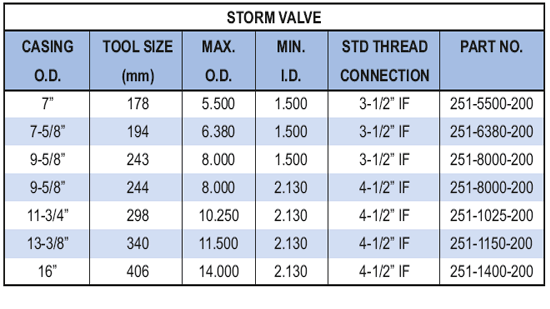

Штормовой клапан PARVEEN устанавливается над сервисным пакером TST-1, чтобы изолировать насосно-компрессорную трубу под пакером для отсоединения во время аварийных явлений окружающей среды или ремонта наземного оборудования. Клапан имеет спусковой инструмент J, который отключается на четверть оборота. Это быстрое, безопасное и экономичное закрытие скважины не требует протягивания НКТ. Клапан может часто встречаться и закрываться независимо от функции отсоединения, что позволяет проводить испытания пакета под давлением перед отсоединением. Усиленный подшипниковый узел требует свободную работу клапана при сжатии спусковой колонны, что пропускает работу на плавучих буровых установках. Перед извлечением пакера можно снова подсоединить и открыть клапан для выравнивания давления.

**Приложения:**

Чрезвычайные ситуации с погодой

Устьевой ремонт

**Особенности, преимущества и выгоды:**

* Прочная конструкция из легированной стали
* Резьбовые соединения бурильных труб с бурильным замком внутри с промывкой (IF) исключительная исключительная, проверенная временем прочность буровых установок.
* Простая, проверенная конструкция по принципу работы с клапаном и ремонтом
* J-образный инструмент, работающий с помощью четверти оборотов спусковой колонны, обеспечивает быстрое и эффективное размещение клапана. Клапан может быть обнаружен и закрывать открытыми поворотами, независимо от функции отсоединения, что позволяет протестировать пакет под давлением перед отсоединением, чтобы убедиться в его охвате.
* Расширяемая заглушка использует сквозной доступ для циркуляции и тросов.

