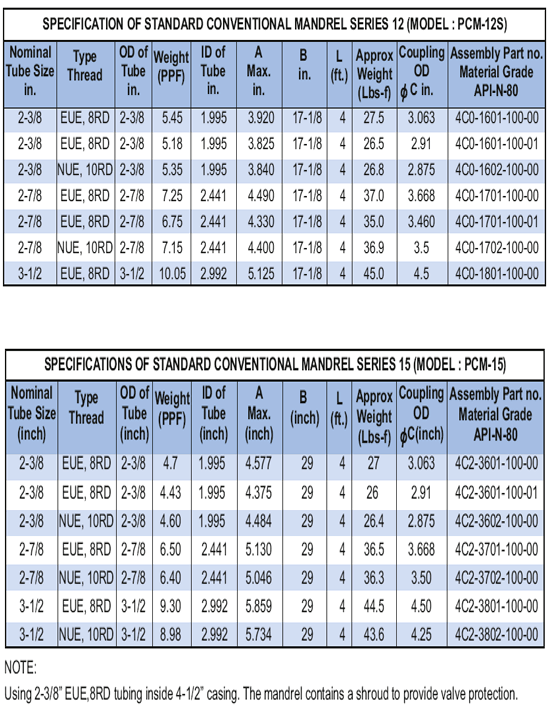

**ОБЫЧНАЯ ОПРАВКА – СЕРИЯ 12 (МОДЕЛЬ: PCM-12S)**

Оправки Серии 12 оценки для установки любого клапана сной проушиной ½” NPT, максимальным наружным диаметром 1-1/16″ и высотой 17,1/8”. Доступны трубы различных размеров, типов и марок резьбы. Ниже приведены только самые популярные сорта и размеры. В поправке используется кожух вместо большого выступа и металлической пластины.

**ОБЫЧНЫЕ ОПРАВКИ – СЕРИЯ 15 (МОДЕЛЬ: PCM-15)**

Традиционные ОПРАВКИ Серии 15 оцениваются для установки любого клапана с входным проушинным соединением ½” NPT, максимальным наружным диаметром 1– ½” и примерно длинной 29″. Доступны трубы многих размеров, резьбы и марок. Ниже приведены только самые популярные сорта и размеры.

