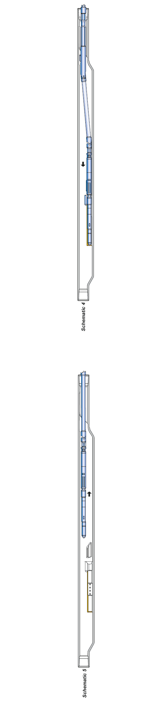

Используются положения в кабеле для получения выборочного определения определения оправки, когда в скважине установлены две или более оправки. Инструмент ориентируется в правильном положении и смещает клапан (или инструмент для вытягивания положения) в над гнездом для установки или извлечения.

**ПРЕИМУЩЕСТВА ПРИНЦИПА ПРОЕКТИРОВАНИЯ**

* Подпружиненный спусковой ключ доводится до упора во втулку оправки, которая подтверждает увеличение веса владельца.
* В сборке имеется только один латунный срезной штифт, который легко заменяется после каждого избранного троса. Штифт можно использовать с выступающим из лубрикатора.
* Большая площадь байпасного потока, как внутреннего, так и внешнего, имеет значительный эффект свабирования во время операций установки или вытягивания.
* Инструмент ощущается в линейном положении, что вызывает его случайное опрокидывание и образование волдырей по стенкам трубок во время вставок и изъятий. Инструмент фиксируется в смещенном положении для точного определения положения кармана при вставлении или извлечении клапана.

**ПРИНЦИП ДЕЙСТВИЯ**

**Схема 1.** Инструмент проходит под оправкой. инструмент фиксируется в жестком положении, он не может случайно опрокинуться.

**Схема 2.** Инструмент поднимается до тех пор, пока его шпонка не войдет в зацепление со втулкой в оправке. Продолжающееся движение вверх вращает инструмент до тех пор, пока его шпонка не войдет в паз. Когда ключевой показатель достигает верхней части пазухи, оператор уведомляется об увеличении веса, отображаемом на индикаторе веса. Теперь инструмент правильно ориентирован.

**Схема 3.** Поворотный рычаг предназначен для поворота и фиксации положения дополнительному натяжению. Это действие активирует клапан или инструмент для вытягивания над гнездом или защелкой на газлифтном клапане.

**Схема 4.** Оправка для регулирования направления клапана или вытягивающего инструмента для посадки клапана или зацепления защелки на клапане.

**Схема 5.** Прямое движение вверх срезает штифт, когда ключ поднимает верхнюю часть паза. Это действие позволяет спусковому крючку свободно доставать из паза и проходить через трубку. Когда поворотный рычаг уменьшает большую часть верхней части оправки, он должен отщелкиваться назад и фиксироваться в верхнем вертикальном рабочем положении, уменьшая сопротивление инструмента и клапана при его удалении.

