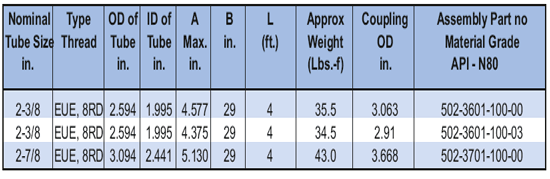

PARVEEN производит отечественные высокопрочные оправки. Их круговой внешний дизайн позволяет легко превращать их в сложные операции и выполнять более сложные операции промывки. Эти оправки превышают прочность НКТ N-80.

Преимущества высокопрочных оправок PARVEEN:

1. Выдерживает тяговое усилие более 60 метрических тонн.

2. Гидравлические до испытаний 8000 фунтов на квадратный дюйм.

**Серия 502:** устанавливается для установки любого клапана с ½” NPT и максимальным наружным диаметром 1-1/2″.

Все вышеперечисленные серии большого размера труб, размеров резьбы и классов, только самые популярные размеры ниже.

