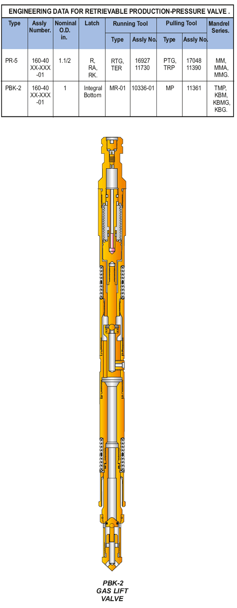

Извлекаемые на кабеле насосы GLV компании PARVEEN, работающие под давлением, используемые для газолифтного производства с непрерывным потоком. Заполненный азотом многослойный монельный сильфон усиливается, требуя обязательного клапана в нормально закрытом положении. Этот клапан содержит встроенный обратный клапан обратного потока.

Доступные размеры портов: 3/16″, 1/4″ и 5/16″

**ТЕХНИЧЕСКИЕ ДАННЫЕ ДЛЯ ИЗЪЕМНОГО ПРОИЗВОДСТВЕННОГО НАПОРНОГО КЛАПАНА**

