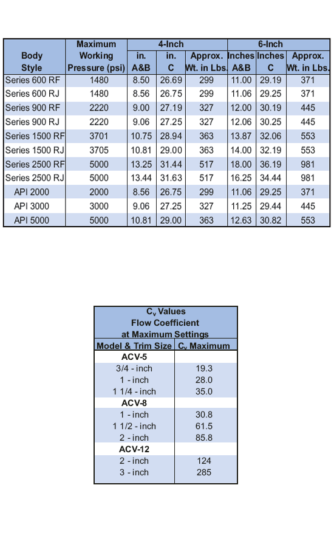

Регулируемые дроссельные клапаны PARVEEN ACV широко применяются в нефтяной, газовой и водной промышленности. Доступны три размера корпуса, чтобы обеспечить надлежащую регулировку дросселя расходу. Максимальное высокое давление до 5000 фунтов на квадратный дюйм является доступным для клапанов ACV8 и ACV-12, более высокое давление доступно для клапанов ACV-5. Легко читаемое кольцо индикатора, откалиброванное с точностью до шестидесяти четверти дюйма, предназначенное для обеспечения точного контроля расхода. Герметичное количество штока обнаружено подпружиненной тефлоновой набивкой.

Замена клапана и седла без снятия корпуса клапана происходили путем простого снятия крышки, для чего не требовались специальные инструменты. Затем сиденье можно вручную снять.

Все клапаны этой серии могут быть оснащены набором или пневматическим приводом в зависимости от соблюдения требований к установке.

**Клапаны серии ACV-12** имеют большое отверстие 3 небольшого и полусбалансированного просвета штока для измерения крутящего момента, необходимого для открытия клапана при наличии высокого перепада давления.

**Клапаны серии ACV-8** имеют большое отверстие 2 дюйма и опциональное седло с дросселированием для высоких перепадов давления.

**Клапаны серии ACV-5** имеют большой размер порта 1 ¼ дюйма.

Все клапаны этой серии производятся с фланцами API или ANSI, а также с соединениями под сварку враструб, под сварку встык или с резьбовыми соединениями.

