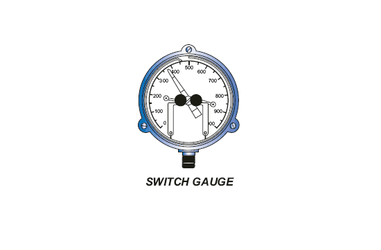

Устанавливаемый специально для привода клапан, электронный блок управления временем цикла с двухступенчатым регулятором и капельным фильтром представляет собой компактный узел, предназначенный для предоставления оператору надежного механизма выключения управления установкой плунжерного подъемника без частого переключения частоты вращения и регулировки времени цикла. Контроллер имеет временной цикл с микропроцессорным таймером, который можно запрограммировать на изображение, вычисление или другую информацию. Контроллер поддерживает время включения, время выключения и время задержки.

Каждый таймер легко устанавливается оператором с помощью специальных клавиш и дисплея на передней панели. Тайминги таймера могут быть в часах или по мере необходимости, чтобы достичь высокой скорости при любых рабочих условиях.

Электронный контроллер имеет прочный, водонепроницаемый корпус с прозрачной прозрачной передней крышкой, которая позволяет оператору контролировать отсчет времени использования цикла, не подвергая воздействию части окружающих атмосферных условий. Кроме того, внутренняя электроника имеет покрытие для защиты от влажного воздуха или агрессивных газов. Катушка электромагнитного клапана и токоограничивающие компоненты полностью герметизированы для предотвращения возможности обнаружения дуги в обнаружении взрывоопасной атмосферы.

**2RBF Двухступенчатый регулятор и капельный фильтр** состоит из двух регуляторов давления и капельного фильтра. Первичный вход регулятора высокого давления до 6000 фунтов на квадратный дюйм подачи газа и 250 фунтов на квадратный вход регулятора вторичного давления понижения давления. Капельный бак содержит набор войлочных фильтров, которые в сочетании с металлокерамическим фильтром в регуляторе высокого давления, имеют сухое, чистое (частицы менее 4 микрон) высокое питание пилота. Корпус капельницы имеет удлинитель для крепления к моторному клапану, который расширяет нестандартную установку.

**Манометры-переключатели** заменяют собой обычные манометры с регулируемыми верхними и нижними уставками для управления работой клапана с электроприводом в ответ на давление в скважине. Во время работы индикатора переключения между контактными рычагами уставки, и когда индикатор касается одного из рычагов, электрическая цепь замыкания, что требуется сигнал на электронный таймер, который управляет работой клапана с электроприводом. Эти сигналы обнаружения часто используются таймером для отключения запрограммированных временных циклов и обычно повышаются и снижаются уровни давления в НКТ и обсадной колонне.

