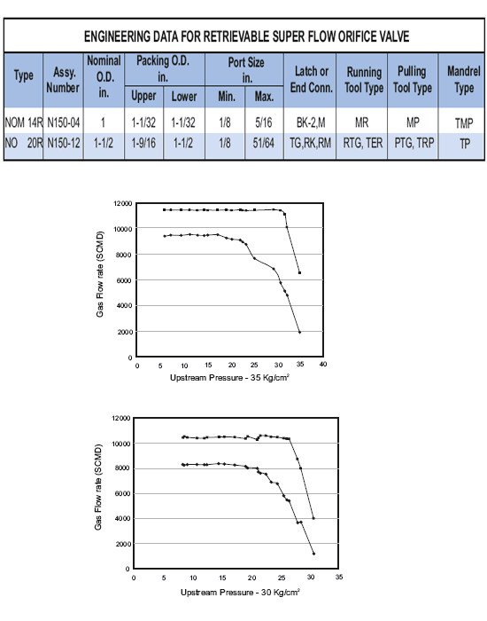

Клапаны PARVEEN с наружным диаметром 1″ и 1-1/2″, извлекаемые на кабеле, нагнетательные газлифтные сверхпоточные дроссельные клапаны используются для приложений с непрерывным потоком. Они касаются циркуляционных операций и потока из обсадной трубы в кольцевое отверстие через отверстие, а затем в насосно-компрессорную трубу.

**ЭКСПЛУАТАЦИЯ**

Дроссельный клапан сверхвысокого расхода использует отверстие Вентури, а также обратный клапан для операций с непрерывным потоком. Инъекционная жидкость поглощает через отверстия входа, из которых проходит через отверстие Вентури. Давление впрыска с обратным клапаном с седла и, таким образом, позволяет жидкости начаться в НКТ. Обратный поток прижимает обратный клапан к седлу, чтобы предотвратить попадание потока в корпус.

PARVEEN успешно разработала после проведения обширных исследований дроссельный клапан Super Flow, который на один шаг опережает обычные дроссельные клапаны, доступные на рынке. Его производительность проверена Институтом технологий добычи нефти и газа, ONGCL, Панвел, Мумбаи, Индия. Кривая производительности клапана НОМ — 14R с диафрагмой (порт — 12/64 дюйма) при различных давлениях вверх по течению 2 2, т. е. 30 кг/см и 35 кг/см показано ниже и сравнение с обычным клапаном с квадратной кромкой также показано ниже.

**АНАЛИЗ РЕЗУЛЬТАТОВ**

1) Критический расход был достигнут при обоснованном отношении 0,878-0,879 давления потока к давлению повышения по потоку, т.е. при перепаде давления 12% по сравнению с почти 50% в случае стандартного отверстия в клапане с обычным отверстием.

2) удельный вес расхода, полученный в результате испытаний, был примерно на 20 % выше расчетного теоретического расхода.

**ТЕХНИЧЕСКИЕ ХАРАКТЕРИСТИКИ ДЛЯ ИЗЪЕМНОГО ДИСКОВОГО КЛАПАНА SUPER FLOW**

