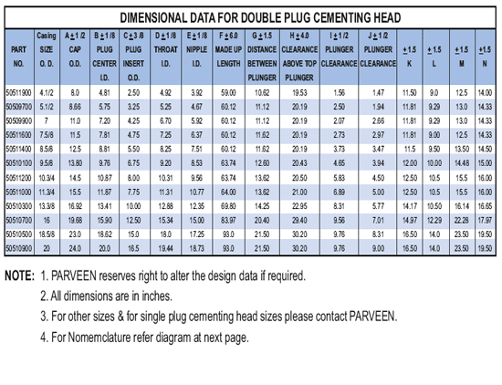

Головка цементировочная PARVEEN связана с цементированием кольцевого пространства между обсадной колонной и стволом скважины на 2-м цикле строительства скважин. Цементировочная головка используется для соединения насосов цементировочных машин с обсадной колонной и доступна для установки цементировочных пробок. Цементировочные головки PARVEEN увеличены в размерах от 4 1/2 до 20 дюймов для рабочего давления от 2000 до 10000 бар. фунтов на квадратный дюйм Размеры цементировочной головки и давление обратно пропорциональны. Как правило, для меньших размеров требуется большее давление, а для больших размеров требуется меньшее давление. Цементировочные головки могут быть одинарного или двойного типа.Крышки имеют резьбу «Acme» или быстродействующий замок и снабжены поворотной цепью в сборе. Цементировочная головка с двумя пробками имеет три вентильных блока и два плунжерных блока.

**ЦЕМЕНТНЫЕ РАБОТЫ**

Цементировочная головка PARVEEN подходит как для одноэтапного, так и для двухэтапного цементирования. Это

снабжения функциями функций:

(а) Указания, когда верхняя заглушка входит в обсадную трубу.

(b) Прост в эксплуатации и получить легкую загрузку заглушек.

(c) Наличие коллектора с пробковым клапаном с малым крутящим моментом.

(d) возникает непрерывная работа.

(e) Контейнер для заглушек содержит одну или две заглушки, почтовый заглушку и большую заглушку. Контейнер с двойной пробкой имеет

трехклапанный коллектор с крутящим моментом и двумя плунжерными узлами.

(f) Длина контейнеров для заглушек соответствует стандартной характеристике заглушек.

(g) Крышка доступна с резьбой ACME и с подъемной цепью для подъема контейнера с пробкой.

(h) Доступны адаптеры со всеми резьбами корпуса и контрфорса.

(i) Стандартные адаптеры имеют 6-дюймовое пространство под ключ с защитой резьбы.

(j) Молотковые соединения, используемые в коллекторах, произведены PARVEEN.

**ЦЕМЕНТИРУЮЩИЕ КОЛЛЕКТОРЫ**

Цементировочные манифольды производятся с цементировочными головками или отдельно по желанию заказчика. Это сборка соединений, заглушек, тройников, ниппелей и т.д. д. Они могут производить до 10 000 фунтов на квадратный дюйм.

