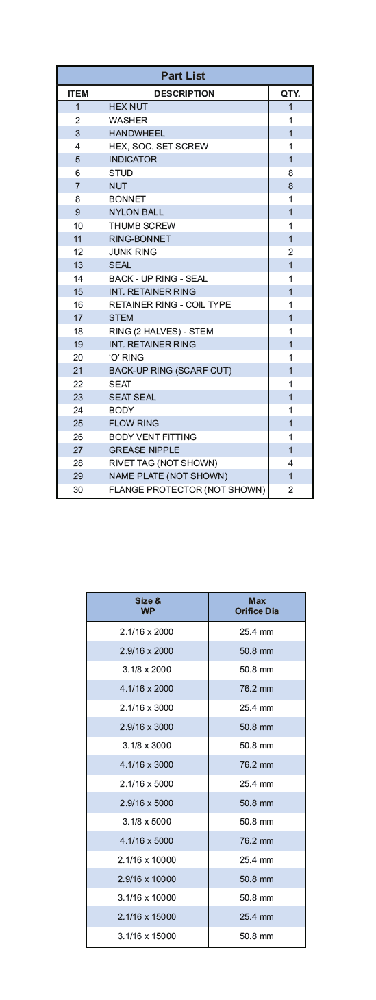
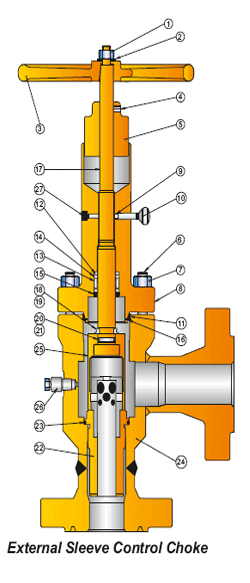

Внешние регулирующие дроссели PARVEEN сводят к минимуму эрозию и улучшают характеристики потока, подходящие для эксплуатации в условиях предэрозионной среды и при высоком перепаде давления с концентрацией песка. Он изменяет принцип «напора потока» для рассеивания и сдерживания остроты кавитации сил внутри прочной толстостенной клетки из карбида вольфрама.

**Другие особенности :**

*   Подпружиненное производство штока, приводящее в действие давление.
*   Проверенное на практике использование металлических крышек.
*   Надежное принудительное отключение.

