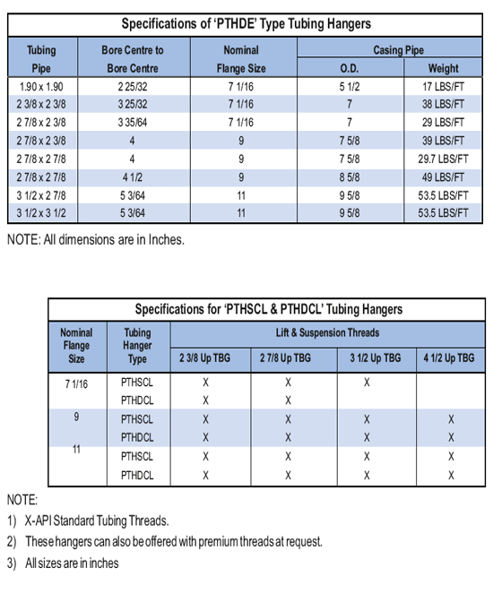

**Подвеска НКТ двойного разъема типа** «PTHDE» используется для применения с двойной колонной НКТ. Для герметизации используется пластиковая упаковка между уплотнениями. Он фиксируется прижимными винтами. Двойные разъемные гидравлические подвески для труб также оснащены линиями управления 1 или 2, называемыми «PTHDCL1» и «PTHDCL2».

