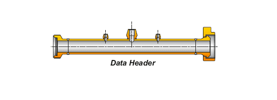
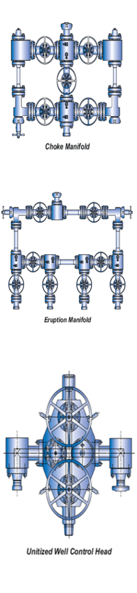

3,1/8 дюйма x 5000 фунтов на квадратный дюйм CWP – 3,1/16 дюйма x 100000 фунтов на квадратный дюйм CWP

**Строительство :**

Установлен на салазках, подходит для работы с сероводородом в соответствии с NACE MR-01-75. В комплекте с 4-5 задвижками/регулируемыми и задержанными дросселями, сквозное отверстие 3 дюйма. С приспособлениями для измерения давления, температуры и отбора проб как до, так и после дросселей.

2,1/16 х 5000 фунтов/кв.

ПСИ НВП

**Строительство :**

На салазках подходит для H2S Service согласно NACE

МР-01-75.

В комплекте с 8 задвижками/регулируемыми и регулируемыми дросселями, сквозное отверстие 2"/3". Ориентация задвижек и дросселей в соответствии с требованиями заказчика. С возможностью измерения давления, температуры и отбора проб как до, так и после дросселей.

3,1/16 дюйма x 10 000 фунтов на квадратный дюйм CWP

**Строительство :**

На салазках – унифицированный тип.

Подходит для H2S Service согласно NACE MR – 01-75.

В комплекте с двумя боковыми выходами, один для подключения к линии Kill, а другой для производственных испытаний.

2”/3”/4” 5000 PSI и 10000 PSI любое давление

Длина от 3 до 8 футов

**Материал:**

Подходит для H2S Service согласно NACE MR-01-75. С концевыми соединениями Union/Grey Lock. Поставляется с несколькими портами, заглушенными или фланцевыми с применением интервалов и градусов. Поставляется с защитной гильзой, манометрами по требованию заказчика.

