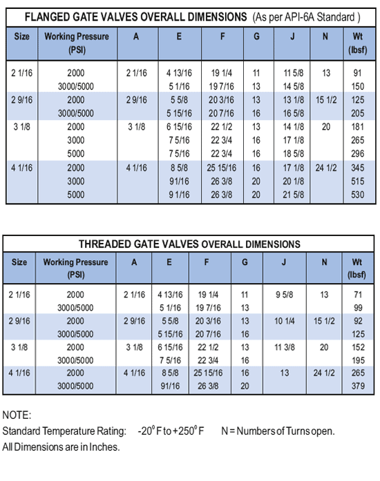

PARVEEN производит задвижки, необходимые для бурения и производственных операций в стиле плит и расширяющихся затворов.

РАСШИРИТЕЛЬНАЯ ЗАДВИЖКА PARVEEN, МОДЕЛЬ 'M':

РАСШИРИТЕЛЬНЫЕ ЗАДВИЖКИ ДЛЯ 2000-5000 PSI. ВП. ПРИЛОЖЕНИЕ

*   Полнопроходной канал
*   Механизм блокировки и исключения
*   Сиденье с длительным сроком службы
*   Положительная печать с использованием механизма фиксации
*   Текущее обслуживание
*   Неподнимающийся и несбалансированный шток
*   Упорный подшипник для работы с низким крутящим моментом

#### ЗАДВИЖКИ ФЛАНЦЕВЫЕ ГАБАРИТНЫЕ РАЗМЕРЫ

