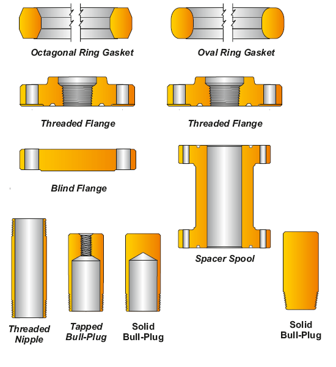

PARVEEN также производит различные виды частых добавок в соответствии с API-6A или спецификацией заказчика.

**ПРИМЕЧАНИЕ:**

По запросу также были предоставлены несколько компонентов соединения (например, двойной тройной коллектор, двойной переходный фланец, двойные фланцевые соединения, многокомпонентное базовое соединение для соединения и т. д.).

