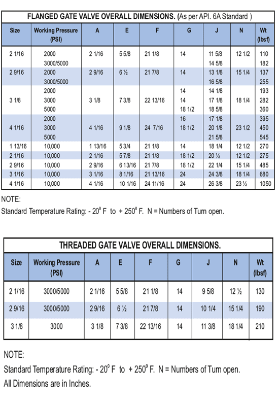

Основные характеристики:

*   Полнопроходной канал
*   Механизм блокировки и исключения
*   Плавающее сиденье с высокой саморазгрузкой
*   Текущее обслуживание
*   Уплотнение металл-металл
*   Заднее сиденье выноса металл к металлу
*   Подшипник для определения условий эксплуатации с низким крутящим моментом и простотой эксплуатации
*   Неподнимающийся и несбалансированный шток
*   Кованый корпус и конструкция капота

#### ГАБАРИТНЫЕ РАЗМЕРЫ ФЛАНЦЕВОЙ ЗАДВИЖКИ. (Согласно стандарту API. 6A)

