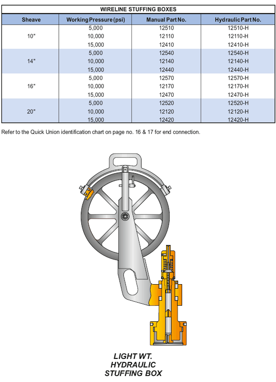

**Особенности и преимущества:**

*   Он герметизирует стационарный или движущийся сплошной трос (кабель) для давления до 15 000 фунтов на квадратный дюйм.
*   Это легкий вес со шкивом из алюминиевого или композитного материала. Размер линии определяет размер шкива и сальников.
*   Ручная и гидравлическая уплотнительная гайка для использования на всемирном языке вокруг троса.
*   Он имеет выдувную заглушку для герметизации на случай разрушения или разрыва линии.
*   Кронштейн шкива может поворачиваться. Он имеет регулируемые направляющие для провода, чтобы удерживать трос в канавке шкива, предотвращая перескакивание троса.
*   Также доступны гидравлические насосы, фитинги, шланги и аксессуары.
*   Легкий корпус, кронштейн шкива, алюминиевый шкив, шкив из композитного материала.

