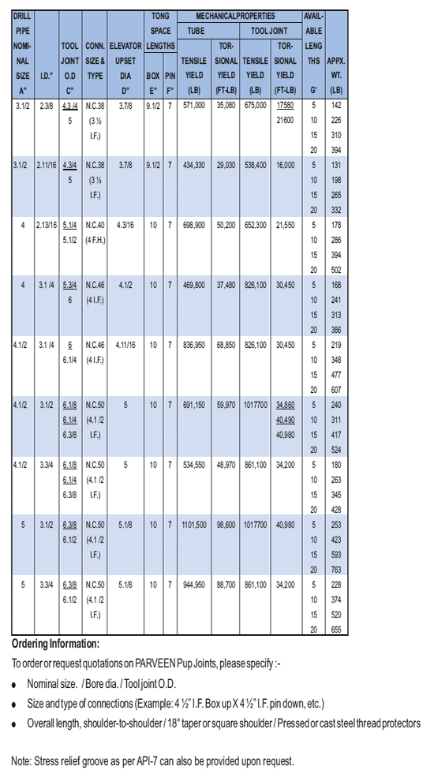

**Компания DPPJ PARVEEN** является важным компонентом бурильной колонны для специальных операций бурения или испытаний. Эта короткая секция бурильной трубы используется для определения положения верхнего короба бурильной колонны на заданном расстоянии от пола бурильной установки.

**DPPJ компании PARVEEN** изготавливается либо из круглого проката, либо путем механической обработки толстостенных труб из материала AISI-4145 H.

