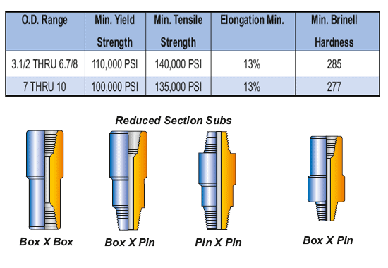

PARVEEN производит все четыре типа преобразователей, например, прямой наружный диаметр типа «A» или тип «B» с уменьшенным сечением, поворотный переключатель типа «C» или подъемный переключатель типа «D» в соответствии с требованиями API 7. Они могут быть с коробчатыми и штифтовыми соединениями или с коробчатым или штыревым соединением с возбудителем. Классификация переводников: (а) переводчики Келли (б) переводники бурильных замков (в) переходные переводчики (г) переводчики УБТ (д) переводники долота (е) поворотные переводчики (ж) подъемные переводчики. Для установки узла поплавкового клапана можно расточить долота. Некоторые сабвуферы показаны после:

**Механические свойства новых стальных переводников бурильной штанги должны соответствовать тем же размерам, что и**  **УБОРНЫЕ УБОРКИ** .

Переводчики, произведенные PARVEEN, должны быть маркированы номером лицензии PARVEEN API, размером диаметра и типом соединений на каждом конце. Эта маркировка будет сделана в углублении, расположенном на внешнем диаметре перевода, прибл. 3 дюйма в ширину, 3/4 дюйма в ширину и 3/16 дюйма в стойку. Для NC 23-31 до NC 70-100 могут быть предусмотрены поворотные плечевые соединения, 2,3/8” Рег. до 8,5/8” Рег. è 5 1/2″ FH и 6,5/8” FH. Любые другие соединения, например Extra Hole (XH), Slim Hole (SH) H-90, Hydril и т.д. д., также могут быть предоставлены по запросу.

