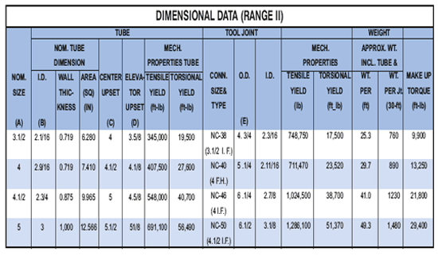

**А) ПОДЪЕМНЫЕ ПРОБКИ**

**PARVEEN** производит заглушки для утяжеленных бурильных труб высокого диаметра. Нижняя часть имеет резьбу, центральная часть просверлена для соединения веса. Изготовлены из материалов и обработаны термообработкой в соответствии с ограничениями утяжеленной бурильной трубы.

**Б) ПОДЪЕМ ПЕРЕВОДНИКОВ**

**Подъемные переводники PARVEEN** изготавливаются из стандартного термообработанного материала утяжеленных бурильных труб в соответствии со спецификацией следующих размеров и рисунков.

**Чтобы заказать или запросить расценки на подъемные пробки PARVEEN, пройти:**

1. Наружный диаметр утяжеленной бурильной трубы

2. Размер и тип соединения утяжеленной бурильной трубы.

3. Диаметр отверстия, если требуется.

**Для заказа или запроса цен на переводы PARVEEN, пожалуйста, включите:**

1.  Наружный диаметр утяжеленной бурильной трубы
2.  Наружный диаметр бурильного замка
3.  Коническое или квадратное плечо
4.  НД бурильной трубы
5.  Размер и тип соединения утяжеленной бурильной трубы
6.  Диаметр отверстия, если требуется
7.  Штампованные или литые стальные протекторы резьбы

