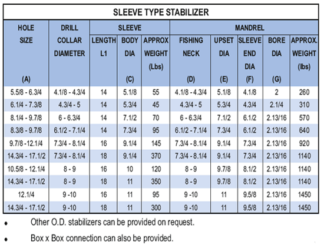

**ХАРАКТЕРИСТИКИ ИНТЕГРАЛЬНОЙ НОЖИ**

1. Ребра вырезаются прямо из туловища.

2. Большое количество вставок из карбида вольфрама, вследствие площади контакта со стенкой, добавляет срок службы инструмента.

3. Ребра снабжения зеркальной отделкой с целью минимизации крутящего момента и получения направления долота и колонны муфты.

4. Изношенные ребра наплавленных стабилизаторов (вставки на металлической связке) обнаруживаются ремонту в магазине ПАРВИН.

**СТАБИЛИЗАТОРЫ ВТУЛОЧНОГО ТИПА**

Этот стабилизатор был разработан со сменной втулкой в полевых условиях. Эта втулка ввинчивается в цельный корпус и может быть легко собрана с помощью вращающихся щипцов. Ловильная шейка и оправка втулки используются с тем же торцевым соединением, что и утяжеленные бурильные трубы. Втулки имеют твердую поверхность из карбида вольфрама (тип-А) или с запрессованными карбид-вольфрамовыми штифтами (Тип-В). Оба типа доступны по запросу клиента. Изношенное твердое покрытие можно отремонтировать в магазине **PARVEEN’s** Shop.

