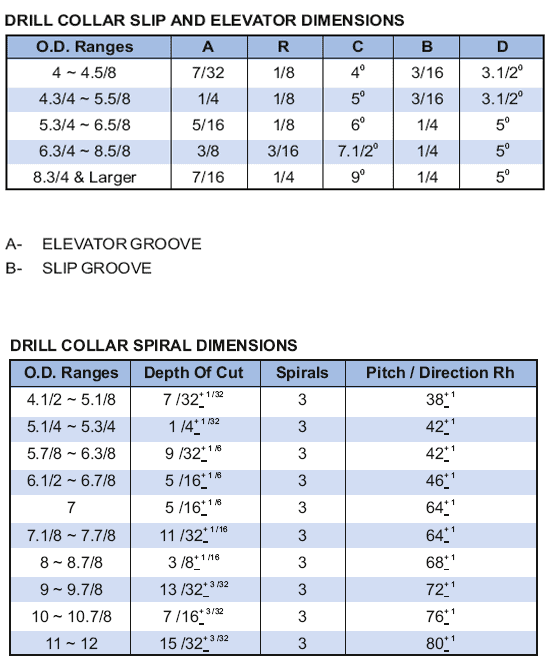

**УБТ стали PARVEEN** изготовлены из прутков хромомолибденовой легированной (модифицированный материал AISI 4145H), прошедших ультразвуковой контроль, и равных во всех размерах и соединениях в соответствии со стандартом API 7 и API-RP 7G по соображениям 2. От 285 до 341 BHN и ударная вязкость по Шарпи 40 футо-фунтов.

