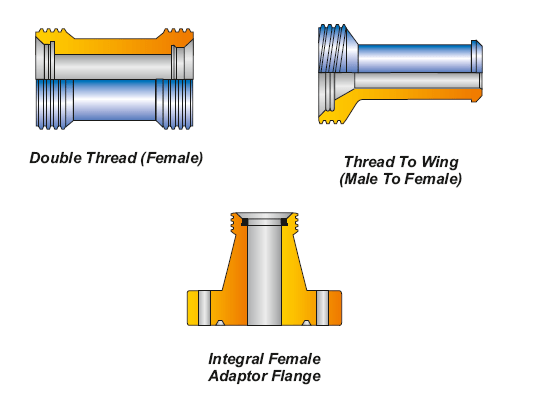

Перекидные/перекрестные переходники PARVEEN изготавливаются с различными размерами и резьбой, конфигурациями типа «папа-папа», «мама-мама», «мама-папа» с размерами от 1″ до 4″ и номинальным давлением от 1000 PSI до 20000 PSI CWP.

**обжимки**

PARVEEN не производит обжимные втулки с соединениями с наружной и внутренней резьбой для труб различных размеров от 1″ до 4″ и конфигураций резьбы с номинальным давлением от 6000 PSI до 15000 PSI CWP. Они достигаются в соответствии с высочайшими стандартами качества, чтобы обеспечить постоянное обслуживание пользователей.

**Меры предосторожности**

1.  Не помещайте стандартные сервисные изделия в высокосернистую газовую среду.
2.  Номинальные значения давления даны для температуры; от -20°F до 100°F. Для работы при температуре выше 100°F указываются с заводом-изготовителем.
3.  Не следует применять чрезмерную силу удара для затягивания молотковых соединений.
4.  При сборе молотых соединений при температуре ниже точки замерзания необходимо соблюдать правила предосторожности.
5.  Не следует ударить по кругу под давлением соединения молотка, иначе может быть отказ от пассажира, который может отправиться к травмам или смерти персонала.

**Встроенные переходные фланцы с внутренней резьбой**

Мы охватываем эти переходные фланцы различных размеров, приближающиеся с 1 13/16″ и далее, и фланцы с величинами номинального давления, приближающимися к концевым соединениям с молотковым соединением.

