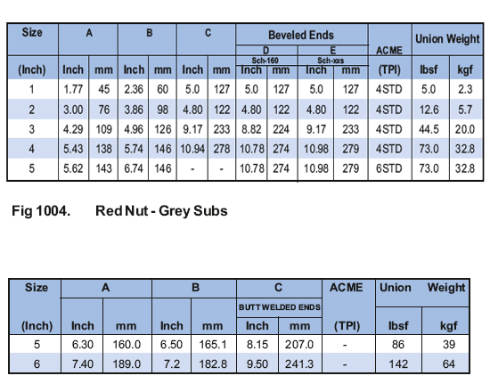

**Рис. 1003. Зеленые подводные лодки — черный орех**

Эти соединения имеют шаровое седло, включающее первичное соединение с металлическим вторичным соединением, которое обеспечивает идеальное использование в местоположении. Средняя несоосность до размера 2” составляет 4, а свыше размера 2” – 7 1/2. Это соединение идеально подходит для использования на линиях высокого давления. Доступен за 10000 фунтов стерлингов на квадратный дюйм с резьбой на конце или с приваркой встык для сварки.

**Рис. 1004. Красный орех — серые переводники**

В этом соединении используется торцевое уплотнительное кольцо с кромкой, здесь грани переходника «папа» и «мама» имеют идеально квадратную форму. Они средних размеров 5″ и 6″ для сварки встык.

