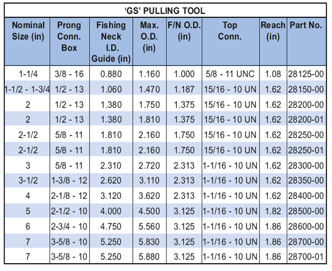

Инструмент для извлечения PARVEEN "GS" предназначен для разблокировки и извлечения глубоких скважин с внутренними ловильными горловинами. Эти инструменты можно высвободить из устройства, встряхнув вниз. Установив переходник сдвига 'GU', инструмент для вытягивания GS можно преобразовать в инструмент для извлечения яса вверх (инструмент для вытягивания GR).

