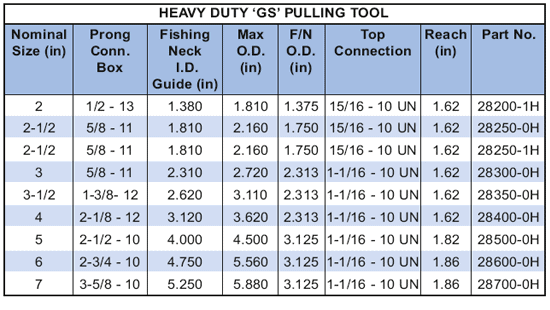

Инструмент для вытягивания PARVEEN Heavy Duty "GS" представляет собой инструмент для вытягивания с полным радиальным контактом для сильного сотрясения и для захвата рыболовных шеков с плохой чешуей. Он также может быть выявлен изношенной или поврежденной рыболовной шейкой благодаря площади контакта с собаками на 35 % больше, чем у стандартного съемника GS.

