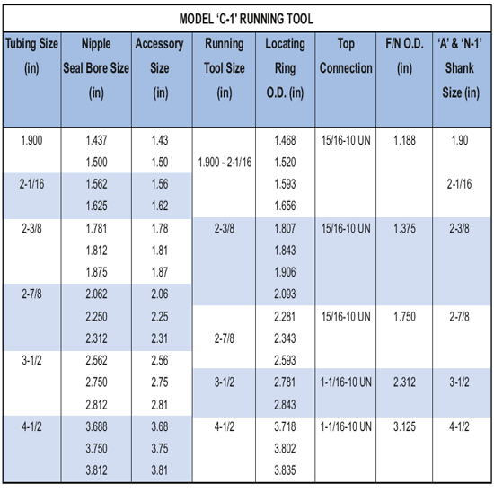

Спусковой инструмент PARVEEN 'C-1' используется для запуска устройств контроля потока PARVEEN, которые имеют наружную ловильную горловину. Он имеет соединение коробкой вниз для крепления хвостовика моделей «A» или «N-1».

Хвостовик модели «А» используется для естественных собак замков моделей «S», «W» и «Z» в убранном положении во время бега. Хвостовик модели N-1 используется для размеров собачек с вытянутыми в замках моделями «G» и «R» во время работы. сам инструмент. Чтобы преобразовать спусковой инструмент C-1 в спусковой инструмент непроходного типа, вместо протектора резьбы установите стопорное кольцо.

