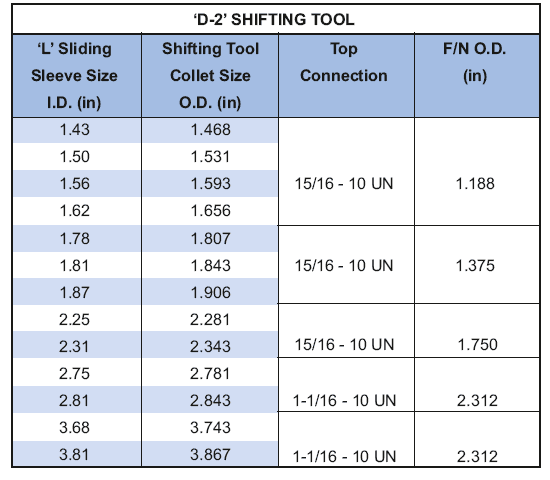

Инструмент переключения PARVEEN Model D-2 используется для обеспечения безопасности, выбора и закрытия скользящей втулки модели L.

**Преимущества:**

1.  **Автоматическая установочная цанга:** сигнализирует оператору о втулке. Он также испытывает раздражение, когда инструмент проходит через втулку или ниппель.
2.  **Доказательство завершения смены:** Как только смена, будь то открытая или закрытая, будет завершена, попытка применения фильтра даст положительное указание на то, что смена была выполнена.
3.  **Функция безопасности:** если муфта открывается при наличии перепада давления в кольцевом пространстве, механизм разблокировки диаметра потока в нерабочем состоянии до тех пор, пока давление не уравновешивается, для обеспечения безопасности удаления.
4.  **Открытие и закрытие муфты за один спуск:** сменные инструменты можно запускать в тандеме, если требуется открыть и закрыть муфты на одном и том же спуске в скважине. Запустите инструмент со сборкой вверх, откройте, чтобы рукава, или со сборкой вниз (перевернутое положение), чтобы закрыть рукава.
5.  **Преднамеренное освобождение:** даже после того, как смещающий инструмент устанавливается во втулку, его можно высвободить, не возвращая закрывающую втулку.

