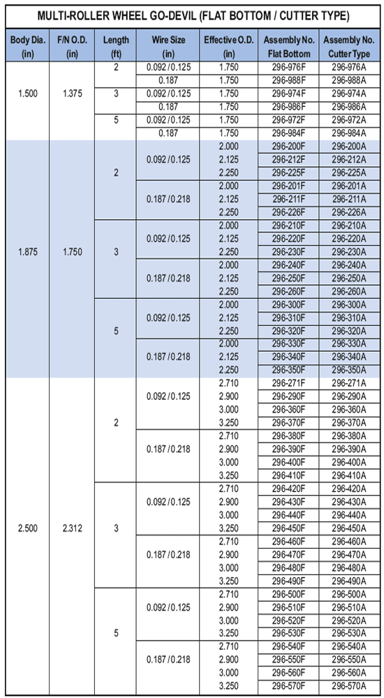

Многороликовая установка Go-Devil компании PARVEEN предназначена для использования в наклонно-направленных скважинах. Конструкция обеспечивает контактное колесо на 360 градусов, что значительно снижает нагрузку на контактный контакт со стенкой трубы.

