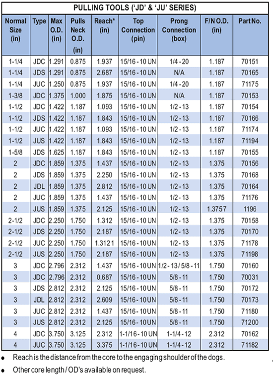

Тяговые инструменты PARVEEN серий «JD» и «JU» используются для захвата и изъятия оборудования с федеральными ловильными шейками. Инструмент для вытягивания серии «JD» предназначен для разрезания и высвобождения пути сотрясения. Эта функция позволяет использовать переносной инструмент серии «JD» в качестве спускового инструмента. Инструмент для вытягивания серии 'JU' предназначен для разрезания и высвобождения пути сотрясения вверх.

Эти факторы являются следствием наличия типов сердечных сокращений:

1. JDC/JUC: длинный сердечник, короткий радиус действия.
2. JDS/JUS: среднее ядро, средний охват.
3. JDL/JUL: Короткий сердечник, большой радиус действия.

Любой из вышеперечисленных типов можно преобразовать в другой, изменчивый источник. Все остальные деталишились прежними.

