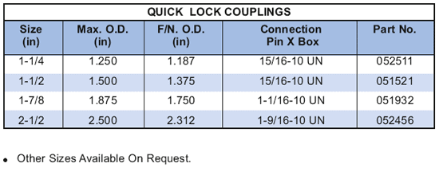

Быстрозажимная муфта PARVEEN используется оператором для быстрого и безопасного переключения инструментов без использования гаечных ключей. С помощью подпружиненного ползуна быстроразъемное соединение легко захватывается или фиксируется вместе.

