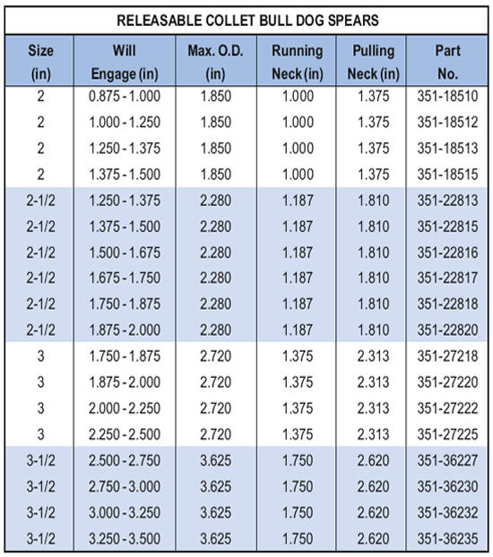

PARVEEN Bull Dog Spear со съемной цангой — это мощный рыболовный инструмент, предназначенный для внутреннего зацепления трубчатых элементов в скважинах. Копье действует на тянущем инструменте «сдвига вверх» и входит в рыбу. Если рыбу невозможно вытащить, срезной штифт, установить внутренний инструмент для вытягивания, срежет инструмент и восстановит его от гарпуна. Используемый здесь инструмент для вытягивания «GR», чтобы получить и извлечь копье из рыбы. Инструмент 'GR' используется для понижения центральной оправки и зацепления внутренней ловильной шейки.Копье Bull Dog со съемной цангой состоит из верхнего перевода внутренней с ловильной шейкой, конической внутренней оправки и верхнего перевода с внутренней оправкой в ​​комплекте внешней с ловильной шейкой, набором цанг и пружиной. Дополнительные обжимные стопорные кольца создаются по запросу.

