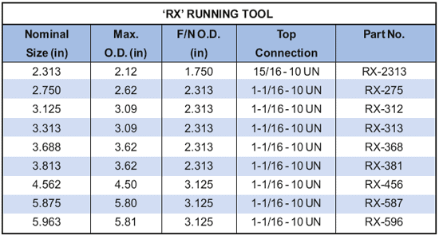

Спусковой инструмент PARVEEN «RX» устанавливает стопорные оправки X, XN, R, RN и RQ в верхние посадочные ниппели типа X, XN, R, RN и RQ. Этот инструмент обычно используется для установки предохранительных клапанов в самый верхний посадочный ниппель. С помощью этого инструмента шпиндель замка можно перемещать, когда ключ находится в контрольном или установочном положении. Ключи стопорного стержня PARVEEN не позволяют найти ниппель, а не кулачки на инструменте для занятий. Когда срабатывает непроходной замок, ключи должны быть установлены в установочное положение, а замок должен быть установлен в первый ппель в отверстии этого замка. Положение стопорного кольца в инструменте разрушения на то, что замок полностью установлен.

