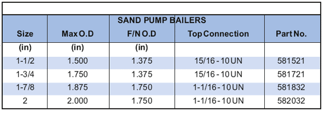

Желонка для пескового насоса PARVEEN используется для удаления песка и мусора, осевшего на поверхности подземного оборудования, препятствующего подъему оборудования с помощью регулярных операций на тросе. Это инструмент насосного типа, который работает по принципу обычного подъема насоса и поршня. Желонки с насосом для песка получаются такими, какие потребляются типа башмаков:

1. С обнаруженным дном: для удобного сбора песка.
2. С наклонным дном: для вычерпывания плотного песка.
3. С нижним клапаном: для сбора образцов металлов, которые не могут проходить через шар и седло.

