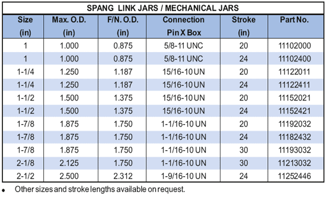

Механические звенья PARVEEN Spang Link / Mechanical Jars используют вес стержней, установленных выше, для создания сотрясающих ударов, манипулируя канатом вверх или вниз. Они состоят из двух частей, составных частей, которые могут расширяться или сжиматься. Эффект сотрясающего воздействия зависит от потребления форштевней, измерения хода, диаметра и отклонения НКТ, вязкости жидкости, скважинного давления, силы на площадь поперечного сечения каната, и скорости движения каната.

