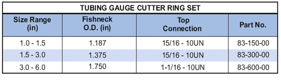

Набор калибровочных режущих колец PARVEEN представляет собой инструмент для обслуживания троса, предназначенный для работы в качестве стандартного прикладного инструмента, но с легкими ощущениями, позволяющими заменять калибровочные резцы различных размеров на стандартном носителе. Для работы требуется несколько калибровочных фрез разного диаметра. Такая гибкость означает, что нет необходимости сохранять запасы фрез различных размеров.

