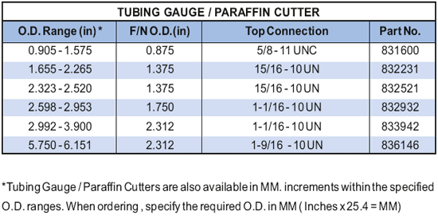

Трубомер/резак для парафина PARVEEN используется в скважине перед спуском любого подземного оборудования. Трубомер / резак для парафина используется для обнаружения каких-либо проникновений для прохода подземного оборудования. Нижняя часть резака для парафина подходит для резкого парафина, окалины или другого присутствия в трубке.

**Выбор размера:**

Пример:

Отверстие ниппеля = 2,25″

ID без перехода = 2197″

Нож для тюбинга должен быть между многими двумя размерами.

