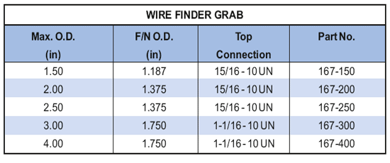

Захват для поиска троса PARVEEN используется так же, как и стандартный захват для троса, для извлечения оборванного троса из ствола скважины. Захват юбки имеет малую вероятность возникновения верхней части оборванного троса.

