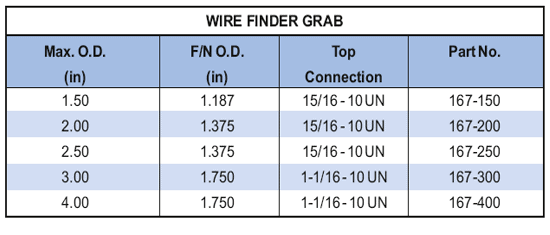

Захват для поиска троса PARVEEN используется так же, как и стандартный захват для троса, для извлечения оборванного троса из ствола скважины. Захват включает в себя юбку, которая предполагает вероятность возникновения повышенной части оборванного троса.

