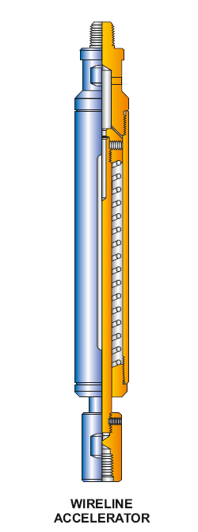

PARVEEN Wireline Accelerator используется для работы с гидравлическим или механическим пружинным механизмом для увеличения силы, уменьшающейся при движении вверх. Натяжение каната вверх сжимает пружину ускорителя, и накапливает энергию, получаемую гидравлическим или пружинным ясу, расположенным внизу. Когда яс срабатывает, масса стержня на колонне усиливается до точки удара. и, таким образом, добавляют генерируемую силу. Он установлен в инструментальной колонне, расположенной под тросовым гнездом.

