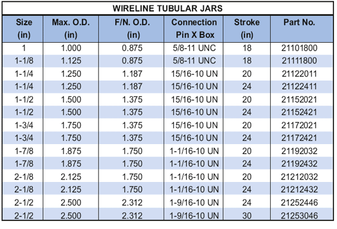

Функциональные возможности, такие же, как и ясы Spang Link, трубчатые ясы PARVEEN работают во время рыболовных операций, когда проволока, мусор или другие посторонние предметы в трубе могут препятствовать резкому действию функций ясов Spang Link. Его также можно использовать в трубах или обсадных трубах большого диаметра, где зарубежные банки с перемычками занимают большие площади запираться и деформироваться.

