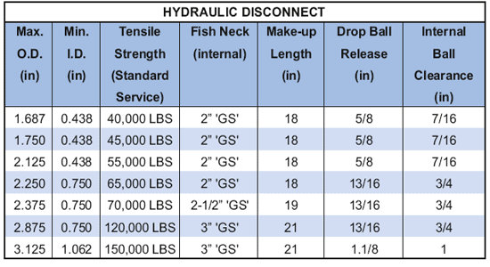

Гидравлический разъединитель позволяет отсоединять инструментальную колонну в заданной производительности за счет развертывания подходящего откидного/спускового шара через гибкую трубу. Падающий шар появляется на втулке поршня, достаточное противодавление, чтобы отрезать штифты и отсоединить инструмент. Все поршневые втулки и шаровые опоры возвращаются на поверхность, восстанавливая стандартную опухоль шейки GS для извлечения.

