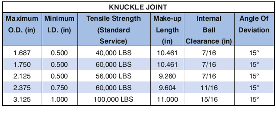

Шарнирное соединение, установленное между суставами и мобильным устройством для манипулирования, требует дополнительной гибкости инструментальной колонны. Шарнирное соединение собрало полное вращение струнного инструмента на 360° и достигло полного углового отклонения 15° и получило широкое распространение на инструмент. Шарик и гнездо шарнирного соединения обеспечивают вращение и угловое отклонение механизма. Уплотнение в шаре герметичность.

