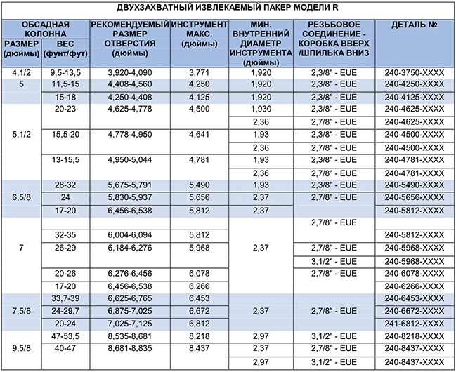

Двухзахватный механический эксплуатационный пакер PARVEEN Model-R представляет собой извлекаемый пакер, фиксирующий сжатием, который изолирует кольцевое пространство от эксплуатационного трубопровода в большинстве операций по добыче, интенсификации притока и испытанию. Проверенная на практике конструкция включает в себя мысль и трехэлементную систему сосредоточения, которая использует правильную установку и использование. Гидравлический прижим обнаруживает перепад давления.

**Особенности, преимущества и выгоды:**

* Детали пакера взаимозаменяемы с другими производителями, что значительны затраты и складские запасы.
* Большой байпас позволяет быстро выравнивать жидкость и ощутимый эффект протирания во время запуска и извлечения для более быстрой работы.
* Стандартный поворот пакера на четверть вправо получается на буровой.
* Блокировка дифференциала помогает держать байпас на оправке закрытым и заблокированным во время операций под высоким давлением, чтобы уменьшить и уменьшить увеличение производства и предполагаемого капитального ремонта для извлечения из скважины и восстановления пакера.
* Оправка с ожидаемым ходом циркуляции жидкости без снятия пакера.
* Пакер автоматически возвращается в исходное положение вверх по скважине, чтобы иметь место циркуляция через него и вокруг него.
* Накладки рокерного типа
* Доступны плашки с карбидными вставками
* Гидравлический прижимной кнопочный блок с большим внутренним каналом потока, попадающим под перепускным клапаном, для объединения задирания элемента и затупления плетения пуговицы.
* Комбинированный байпасный и уравнительный клапан с пожарным управлением

**Параметры:**

* Пакер доступен с возможным левым поворотом для установки

